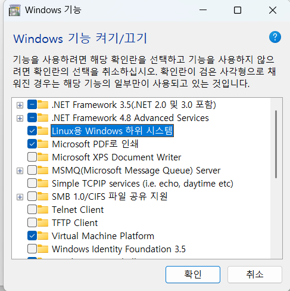
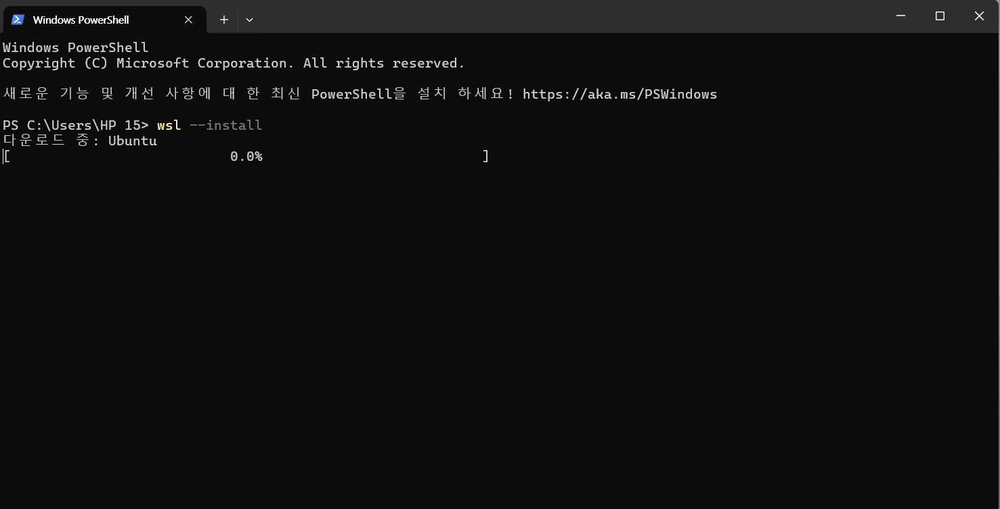
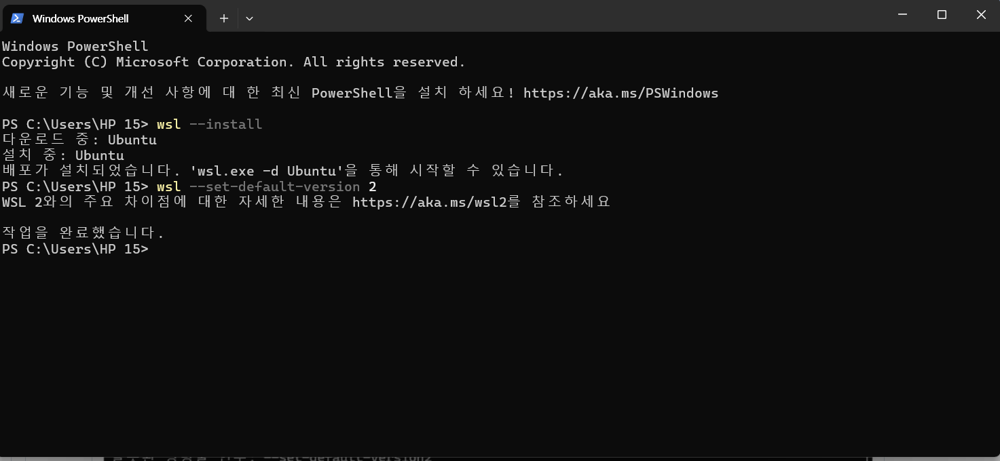
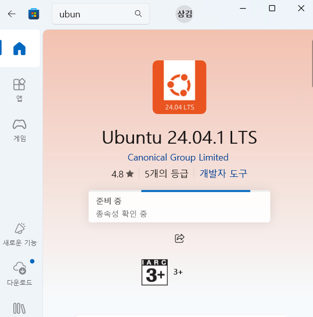

## 1. 강의 소개 및 유닉스/리눅스 개요

*   **강의 목표**: 유닉스/리눅스 시스템의 체계적인 이해와 활용 능력 향상
*   **교재 내용**: 시스템 소개, X 윈도우 환경, 명령어, 파일 시스템, 프로세스, 인터넷/서버, 쉘 스크립트, 유틸리티, 시스템 관리

## 2. 유닉스의 특징 및 시스템 구조

*   **유닉스의 설계 철학**: 단순성, 이식성, 개방성
*   **유닉스의 특징**:
    *   다중 사용자/프로세스
    *   쉘 프로그래밍
    *   뛰어난 네트워킹
*   **유닉스 시스템 구조**:
    *   운영체제
    *   커널 (핵심)
    *   시스템 호출
    *   쉘 (인터페이스)
*   **커널 역할**: 하드웨어 관리, 프로세스/파일/메모리 관리, 통신/주변장치 관리

## 3. 유닉스/리눅스 역사 및 버전

*   **유닉스 역사**: AT&T 벨 연구소 개발, C 언어로 작성, 소스 코드 개방
*   **유닉스의 흐름**: 시스템 V, BSD 유닉스, 리눅스
*   **다양한 유닉스 기반 운영체제**: 시스템 V, BSD 유닉스, 솔라리스, 맥 OS, 안드로이드, iOS 등
*   **리눅스 특징**:
    *   PC용 효율적 유닉스 시스템
    *   소스 코드 공개
    *   다양한 플랫폼 지원
    *   GNU 소프트웨어와 배포

## 4. 리눅스 설치 및 사용 환경

*   **리눅스 배포판**: 커널 공유, 데스크톱 환경/응용 프로그램 차이 (예: 우분투, CentOS)
*   **설치 방법**:
    *   직접 설치 (DVD/USB)
    *   가상 머신 설치
*   **가상 머신**: VirtualBox (무료), VMware (유료)
*   **사용 환경**: 터미널 화면, 원격 로그인 (SSH)
*   **사용자 계정 관리**: 사용자 관리 도구, 사용자 계정 추가, 슈퍼 유저 (root) 권한 획득


  ## 실습: WSL 설치

참고 링크: https://200-rush.tistory.com/entry/WSLInstall

#### 1. 리눅스용 윈도우 하위 시스템 기능이 켜져 있는지 확인



변경시 재부팅

#### 2. 쉘에서 wsl 설치
```
wsl --install
```



기본 버전 변경

위의 링크에서 리눅스 커널 업데이트 패키지를 설치를 먼저 한 후에 변경합니다.

```
wsl --set-default-version 2
```

---|

설정 후 재부팅

#### 3. 스토어에서 우분투 설치


---| ---


### 계정 이름 설정 밑 결과


