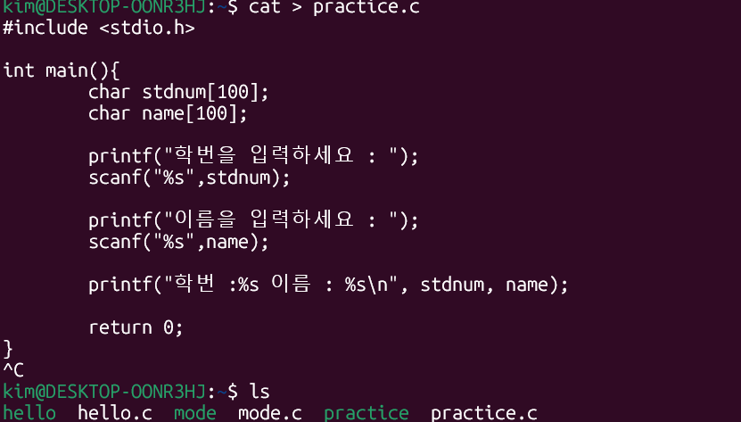
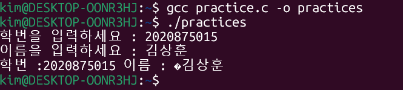

## 3.1 기본 명령어

- **날짜 및 시간 확인**  
  - `date` 명령어: 현재 날짜와 시간(KST 기준)을 출력합니다.

- **시스템 정보 확인**  
  - `hostname`: 시스템의 네트워크 이름 확인  
  - `uname`, `uname -a`: 운영체제, 커널 등 시스템의 상세 정보를 출력합니다.

- **사용자 정보 확인**  
  - `whoami`: 현재 로그인한 사용자 이름을 출력  
  - `who`: 시스템에 로그인한 사용자들의 정보를 보여줍니다.

- **디렉터리 내용 확인**  
  - `ls` 명령어: 현재 디렉터리 내의 파일 및 폴더 목록을 확인합니다.

- **패스워드 변경 및 화면 정리**  
  - `passwd`: 사용자의 암호를 변경합니다.  
  - `clear`: 터미널 화면을 정리합니다.

- **온라인 매뉴얼과 명령어 설명**  
  - `man <명령어>`: 명령어의 상세 사용법을 보여줍니다.  
  - `whatis <명령어>`: 명령어에 대한 간단한 설명을 출력합니다.

---

## 3.2 파일과 디렉터리

- **파일 종류**  
  - **일반 파일 (ordinary file)**: 텍스트 파일이나 이진 파일처럼 데이터를 담고 있는 기본 파일  
  - **디렉터리 (directory / folder)**: 파일들을 계층적으로 구조화하기 위한 특수 파일  
  - **장치 파일 (device special file)**: 키보드, 모니터, 프린터 등 물리적 장치를 파일처럼 다루기 위한 파일  
  - **심볼릭 링크 (symbolic link)**: 다른 파일의 경로명을 저장하여, 간접적으로 해당 파일을 가리키는 파일

- **디렉터리 계층구조**  
  - 리눅스 시스템은 루트 디렉터리(`/`)에서 시작하여 트리 형태의 계층 구조를 이룹니다.

- **경로명의 구분**  
  - **절대 경로명 (absolute pathname)**: 루트(`/`)부터 시작하는 전체 경로로 파일 또는 디렉터리의 위치를 명시  
  - **상대 경로명 (relative pathname)**: 현재 작업 중인 디렉터리 기준으로 파일 또는 디렉터리의 위치를 지정

---

## 3.3 디렉터리 명령어

- **현재 작업 디렉터리 확인**  
  - `pwd`: 현재 작업 디렉터리의 절대 경로를 출력합니다.

- **디렉터리 이동**  
  - `cd [디렉터리]`: 지정한 디렉터리로 이동  
  - `cd` 또는 `cd ~`: 홈 디렉터리로 이동  
  - `cd ..`: 상위(부모) 디렉터리로 이동

- **디렉터리 생성**  
  - `mkdir [디렉터리명]`: 새 디렉터리를 생성  
  - `mkdir -p [경로]`: 중간 디렉터리가 없을 경우 자동으로 생성

- **디렉터리 삭제**  
  - `rmdir [디렉터리명]`: 빈 디렉터리만 삭제할 수 있습니다.

---

## 3.4 디렉터리 리스트


- **기본 명령어**  
  - `ls` 또는 `dir`: 지정한 디렉터리(또는 현재 디렉터리)의 파일 및 폴더 목록을 출력

- **주요 옵션**  
  - `-a`: 숨겨진 파일(예: `.` 및 `..`)을 포함하여 모두 표시  
  - `-l`: 파일의 종류, 권한, 소유자, 크기, 수정 시간 등 상세 정보를 긴 형식으로 출력  
  - `-s`: 파일 크기를 K바이트 단위로 출력  
  - `-F`: 파일의 종류를 구분하여 기호(예: `/`는 디렉터리, `*`는 실행 파일, `@`는 심볼릭 링크)로 표시  
  - `-R`: 하위 디렉터리를 포함해 재귀적으로 모두 출력

---

## 3.5 파일 내용 출력

- **파일 생성 및 수정**  
  - `cat > [파일명]`: 표준 입력을 받아 파일에 저장 (파일이 없으면 새로 생성)  
  - `touch [파일명]`: 크기가 0인 빈 파일을 생성

- **파일 내용 출력**  
  - `cat [파일명]`: 파일 전체 내용을 터미널에 출력  
  - `cat -n [파일명]`: 각 줄 앞에 번호를 붙여 출력

- **파일 내용을 페이지 단위로 확인**  
  - `more [파일명]`: 페이지 단위로 파일 내용을 출력하여 긴 파일도 쉽게 읽을 수 있습니다.

- **파일 일부 내용 확인**  
  - `head [파일명]`: 파일의 앞부분을 출력  
  - `tail [파일명]`: 파일의 뒷부분을 출력

- **단어, 줄, 문자 세기**  
  - `wc`: 파일 내 줄(`-l`), 단어(`-w`), 문자(`-c`)의 개수를 셉니다.


---
  ## 실습: C파일언어 만들어서 실행하기
  
**1.cat로 파일 만들기**
 - practice.c파일 만들기
   ```
   cat > practice.c
   ```

   

**2. 리눅스에 gcc 설치하기**

   - gcc 설치하기
   ```
   sudo apt install gcc
   ```

**3.c파일 실행하기**
 - 컴파일 하기
   ```
   gcc practice.c -o practice
   ```
- 실행
   ```
   ./practice
   ```

   
