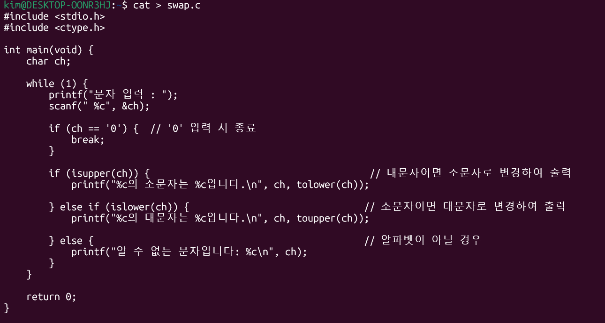
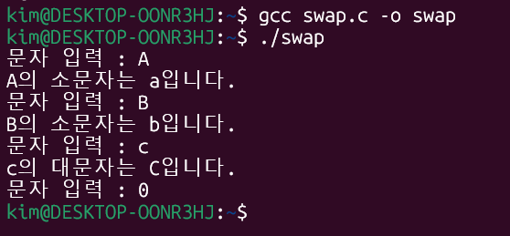

# 슬라이드 내용 목차

## 1. 파일 기본 관리

### a. 파일 복사 (`cp`)
- **기능:** 파일 및 디렉터리를 복제하는 명령어입니다.
- **옵션:**
  - `-i`: 대상 파일이 이미 존재할 경우 덮어쓸지 확인하는 옵션입니다.
  - `-r`: 디렉터리 및 그 안의 내용까지 모두 재귀적으로 복사하는 옵션입니다.

### b. 파일 이동 및 이름 변경 (`mv`)
- **기능:** 파일/디렉터리를 옮기거나 이름을 바꾸는 명령어입니다.
- **옵션:**
  - `-i`: 대상 파일이 이미 존재할 경우 덮어쓸지 확인하는 옵션입니다.

### c. 파일 삭제 (`rm`)
- **기능:** 파일/디렉터리를 영구 제거하는 명령어입니다.
- **옵션:**
  - `-i`: 삭제하기 전에 각 파일마다 확인하는 옵션입니다.
  - `-r`: 디렉터리 및 그 안의 내용까지 모두 재귀적으로 삭제하는 옵션입니다.


## 2. 파일 링크 활용

### a. 링크 개념
- **내용:** 하드 링크와 심볼릭 링크의 정의 및 차이점

### b. 하드 링크 (`ln`)
- **기능:** 원본과 동일한 i-node를 가리키는 파일 이름 생성 방법입니다.

### c. 심볼릭 링크 (`ln -s`)
- **기능:** 원본 파일의 경로를 가리키는 바로가기 생성 방법입니다.
- **옵션:**
  - `-s`: 심볼릭 링크를 생성하도록 지정하는 필수 옵션입니다.

## 3. 파일 속성 및 접근 권한

### a. 파일 속성 확인 (`ls -l`, `file`)
- **기능:** 파일의 상세 정보(종류, 권한, 소유자, 크기 등)를 확인하는 명령어입니다.

### b. 접근 권한 이해
- **내용:** 읽기(`r`), 쓰기(`w`), 실행(`x`) 권한과 사용자(소유자, 그룹, 기타) 구분 방식

### c. 접근 권한 변경 (`chmod`)
- **기능:** 8진수 또는 기호 모드로 파일/디렉터리 권한을 수정하는 명령어입니다.
- **옵션:**
  - `-R`: 지정한 디렉터리 및 그 하위의 모든 파일/디렉터리에 대해 재귀적으로 권한을 변경하는 옵션입니다.

## 4. 기타 파일 속성 변경

### a. 소유자 변경 (`chown`)
- **기능:** 파일/디렉터리의 소유 사용자를 변경하는 명령어입니다.
  *(관리자 권한 필요)*
- **옵션:**
  - `-R`: 지정한 디렉터리 및 그 하위의 모든 파일/디렉터리에 대해 재귀적으로 소유자를 변경하는 옵션입니다.

### b. 그룹 변경 (`chgrp`)
- **기능:** 파일/디렉터리의 소속 그룹을 변경하는 명령어입니다.
- **옵션:**
  - `-R`: 지정한 디렉터리 및 그 하위의 모든 파일/디렉터리에 대해 재귀적으로 그룹을 변경하는 옵션입니다.

### c. 최종 수정 시간 변경 (`touch`)
- **기능:** 파일의 수정/접근 시간을 갱신하거나 빈 파일을 생성하는 명령어입니다.


## 실습: C언어 프로그램 만들기

대문자를 입력받으면 소문자로 출력하고, 소문자를 입력받고 대문자로 출력하는 프로그램을 작성 하시오. 단 0을 입력하면 종료.

#### [입출력형식]
```
문자 입력 : A
A의 소문자는 a입니다.
문자 입력 : B
B의 소문자는 b입니다.
문자 입력 : c
c의 대문자는 C입니다.
문자 입력 : 0
```

### 코드


### 결과

