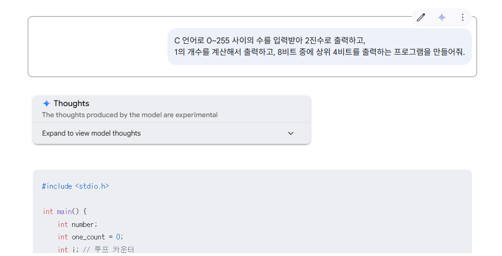
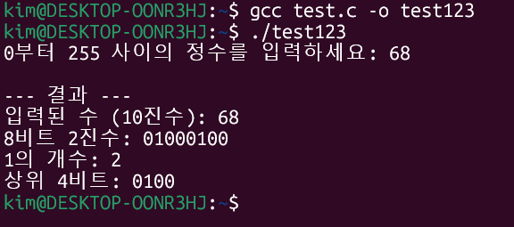

# 인공지능 활용 요약 정리

## 📚 목차
1. [인공지능의 이해](#인공지능의-이해)
2. [LLM의 이해와 기초활용](#llm의-이해와-기초활용)
3. [챗봇 AI별 특징 알아보기](#챗봇-ai별-특징-알아보기)
4. [AI와 실무 문서 작성하기](#ai와-실무-문서-작성하기)
5. [검색의 신세계 AI 검색](#검색의-신세계-ai-검색)
6. [시각화부터 PPT까지 AI로 뚝딱](#시각화부터-ppt까지-ai로-뚝딱)
7. [AI로 이미지 생성하기](#ai로-이미지-생성하기)
8. [무료 영상 생성](#무료-영상-생성)
9. [오디오 AI 활용](#오디오-ai-활용)
10. [반복되는 업무는 챗봇에게](#반복되는-업무는-챗봇에게)

---

## 인공지능의 이해

- 인공지능(AI)은 인간의 지능을 모방해 학습하고 문제를 해결하는 기술이다.  
- 자연어 처리, 자율주행, 의료 진단 등 다양한 분야에 활용된다.  
- 기계학습과 딥러닝 기술을 바탕으로 빠르게 발전하고 있다.  
- 동시에 윤리 문제, 일자리 대체, 프라이버시 침해 등의 사회적 이슈도 함께 제기된다.  

---

## LLM의 이해와 기초활용

- LLM(Large Language Model)은 대규모 텍스트 데이터를 학습해 다양한 언어 작업을 수행할 수 있는 인공지능 모델이다.  
- 제로샷, 원샷, 퓨샷 프롬프팅을 통해 예시 없이도 혹은 예시를 몇 개만으로도 문제를 해결할 수 있다.  
- 프롬프트 설계 기법에는 역할 지정, 시대 설정, 문장 미완성 질문, 유사 문제 제시 등이 포함된다.  
- 마크다운 형식이나 다양한 질문 구조를 활용하면 LLM의 성능을 효과적으로 끌어낼 수 있다.  

---

## 챗봇 AI별 특징 알아보기

- 다양한 챗봇 AI는 각각 기능과 특징이 다르며, 모델 선택이 중요하다.  
- 구글, 네이버, Perplexity 등은 검색 기능과 연동되며, 파일 업로드, 음성 입력, 한국어 최적화 등 다양한 기능을 제공한다.  
- 메모리 기능으로 사용자의 성향을 기억하거나 삭제할 수 있고, 맞춤 설정도 가능하다.  
- 일부 챗봇은 유료 모델 선택이 가능하며, 멀티모달 기능이나 스킬 연동 등 특화된 기능도 제공한다.  

---

## AI와 실무 문서 작성하기

- AI는 다양한 실무 문서를 작성할 때 페르소나(역할), 과업, 맥락, 어조, 형식 등을 명확히 설정해 활용할 수 있다.  
- 이메일, 주간보고서, 보도자료, SNS 광고카피, 신사업 기획서, PPT 기획 등 다양한 비즈니스 문서 작성에 AI가 효과적으로 사용된다.  
- 실무에서는 문서의 목적과 타겟에 맞춰 AI에게 명확한 지시를 주는 것이 핵심이며, 결과물의 품질은 프롬프트 설계에 달려 있다.  
- 회의록 작성 등 반복 업무에도 AI를 활용해 시간과 노력을 절약할 수 있으며, 출력 형식까지 자동화 가능하다.  

---

## 검색의 신세계 AI 검색

- AI 검색은 기존 학습된 정보와 실시간 검색 결과를 결합해 보다 정확하고 최신의 답변을 제공한다.  
- 사용자의 입력을 학습하거나 비활성화할 수 있으며, 다양한 검색 소스와 출처 기반 응답이 가능하다.  
- 질문을 묶어서 정리하고, 파일이나 링크를 포함한 복합적인 질문에도 대응할 수 있다.  
- 여러 국가의 다양한 기업에서 개발된 검색 AI들이 각기 다른 특화 기능(예: 금융, 재무분석, 추론 등)을 제공한다.  

---

## 시각화부터 PPT까지 AI로 뚝딱

- AI를 활용하면 데이터 분석부터 차트 시각화, PPT 제작까지 손쉽게 자동화할 수 있다.  
- 데이터를 프롬프트 창에 드래그 앤 드롭하여 분석을 시작하며, 한글이 깨질 경우에는 폰트 추가로 해결 가능하다.  
- 계산된 결과를 바탕으로 다양한 형태의 차트를 생성할 수 있다.  
- draw.io 등을 활용해 시각 자료를 직접 만들고, 도형이나 텍스트를 자유롭게 편집할 수 있다.  

---

## AI로 이미지 생성하기

- AI 이미지 생성은 스타일, 색상, 텍스처 등을 조절해 다양한 결과물을 만들 수 있으며, 부분 수정도 가능하다.  
- 텍스트 프롬프트로 이미지 초안을 빠르게 생성할 수 있고, 오픈소스 모델이나 DALL·E 3 등을 활용할 수 있다.  
- 특정 스타일이나 카메라 기종을 지정하거나, 기존 이미지를 템플릿처럼 활용하는 것도 가능하다.  
- 한글 인식이 제한적이므로, 텍스트는 번역하거나 영어로 입력하는 것이 효과적이다.  

---

## 무료 영상 생성

- AI를 이용해 무료로 짧은 영상(쇼츠 등)을 생성할 수 있으며, 일부 플랫폼은 월간 크레딧이나 2주 무료 이용을 제공한다.  
- 프롬프트에 카메라 앵글, 장면 설명, 디테일 요소를 구체적으로 입력하면 영상의 질이 높아진다.  
- 프롬프트에 따라 에러가 발생할 수 있으며, 이 경우 프롬프트를 수정해야 한다.  
- 예시로는 "화려한 꽃밭을 뛰어다니는 장난끼 가득한 토끼"처럼 생생하고 구체적인 묘사가 효과적이다.  

---

## 오디오 AI 활용

- 오디오 AI를 활용하면 문장을 다양한 캐릭터 목소리로 변환하거나 캐릭터를 자유롭게 변경할 수 있다.  
- 전체 보이스 목록에서 원하는 음성을 선택하고 필터링 기능도 사용할 수 있다.  
- AI를 통해 음악 및 가사를 생성하거나 기존 가사를 수정할 수도 있다.  
- 프롬프트는 하루 약 5번 정도 입력 가능하며, 웹 브라우저에서 쉽게 접근 가능하다.  

---

## 반복되는 업무는 챗봇에게

- 반복되는 업무(예: 회의록 정리, 문서 초안 작성 등)는 챗봇을 통해 자동화할 수 있다.  
- 프롬프트 입력만으로 회의 스크립트를 정리하거나 업무에 필요한 기본 문서를 빠르게 생성할 수 있다.  
- 챗봇 제작을 쉽게 도와주는 플랫폼이 있으며, 연구 자료 검색에도 GPT 기반 AI를 효과적으로 활용할 수 있다.  

---
## 실습: 생성형 AI를 활용한 프로그래밍

### 프롬프트


### 코드
```
#include <stdio.h>

int main() {
    int number;
    int one_count = 0;
    int i; // 루프 카운터

    // 1. 0~255 사이의 정수 입력 받기 (유효성 검사 포함)
    do {
        printf("0부터 255 사이의 정수를 입력하세요: ");
        scanf("%d", &number);

        if (number < 0 || number > 255) {
            printf("잘못된 범위의 숫자입니다. 다시 입력해주세요.\n");
        }
    } while (number < 0 || number > 255); // 조건이 참인 동안 반복 (즉, 잘못된 입력이면 반복)

    printf("\n--- 결과 ---\n");
    printf("입력된 수 (10진수): %d\n", number);

    // 2. 8비트 2진수로 출력하고 1의 개수 계산
    printf("8비트 2진수: ");
    for (i = 7; i >= 0; i--) {
        // (1 << i)는 해당 비트 위치의 값 (예: i=7이면 10000000 (128))
        // number 와 비트 AND 연산(&)을 해서 해당 비트가 1인지 확인
        // 결과를 i만큼 오른쪽 시프트하여 1 또는 0으로 만듦 (또는 아래처럼 바로 비교)

        int bit = (number >> i) & 1; // i번째 비트를 0번째 위치로 가져와서 1과 AND 연산

        printf("%d", bit); // 해당 비트(0 또는 1) 출력

        // 1의 개수 세기
        if (bit == 1) {
            one_count++;
        }
    }
    printf("\n"); // 줄 바꿈

    // 3. 1의 개수 출력
    printf("1의 개수: %d\n", one_count);

    // 4. 상위 4비트 출력 (7번 비트 ~ 4번 비트)
    printf("상위 4비트: ");
    for (i = 7; i >= 4; i--) {
        int bit = (number >> i) & 1; // 동일한 로직으로 해당 비트 추출
        printf("%d", bit);
    }
    printf("\n"); // 줄 바꿈

    return 0; // 프로그램 정상 종료
}
```
### 결과


